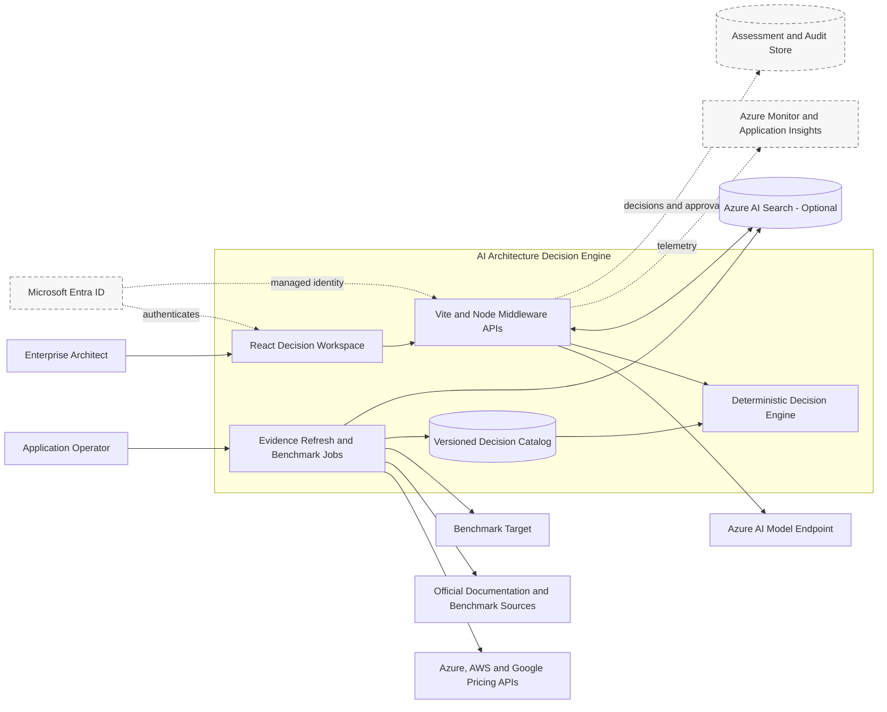
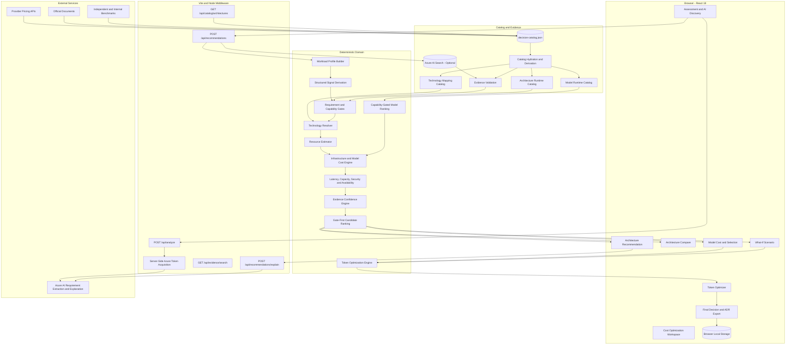
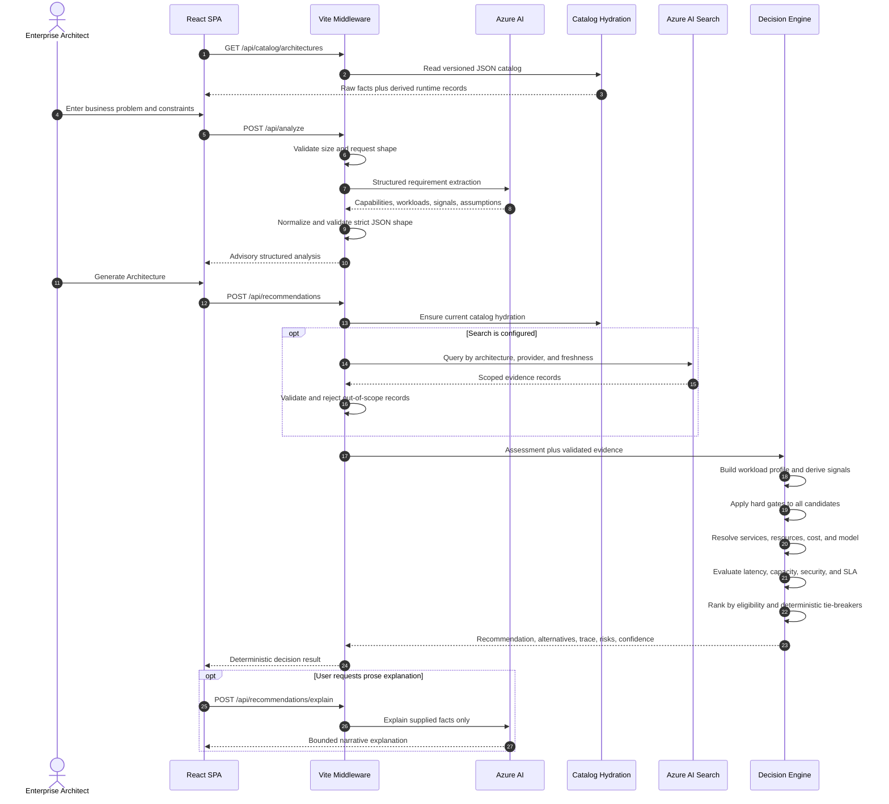
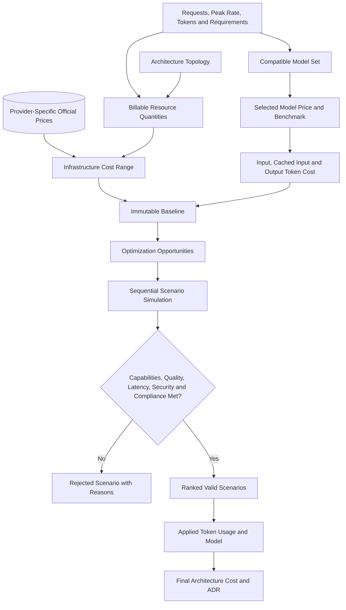
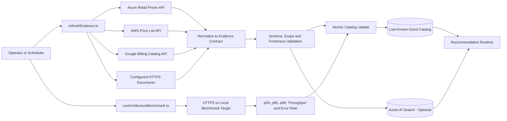
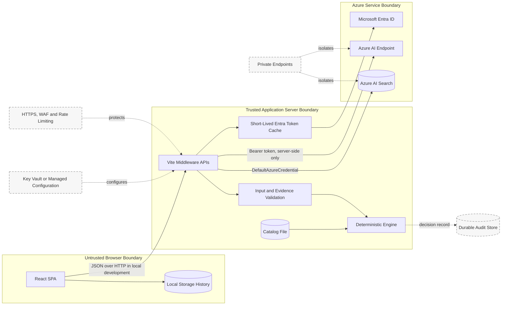
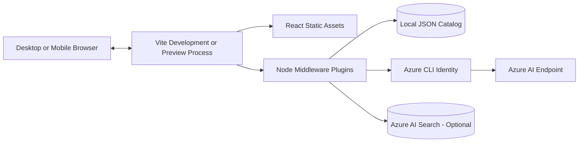
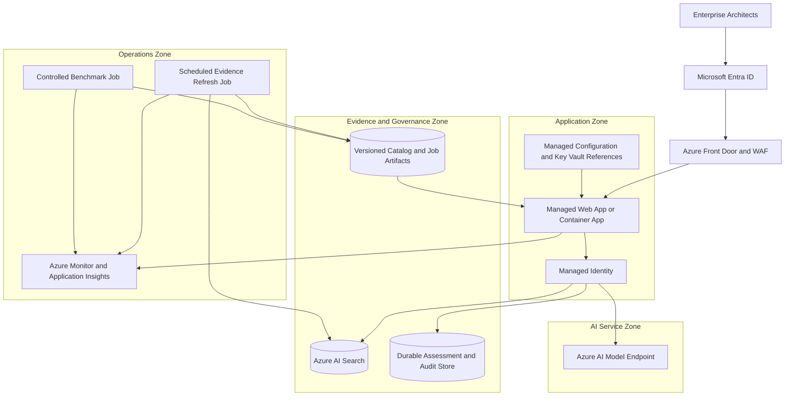

# AI Architecture Decision Engine - Whole Solution Architecture

## 1. Architecture Summary

The AI Architecture Decision Engine is an evidence-driven decision-support application for enterprise architects. It combines AI-assisted requirement extraction with a deterministic recommendation engine. Azure AI converts a business problem into structured requirement signals, but it does not choose an architecture, model, provider, or winner.

The recommendation engine evaluates a versioned catalog of architecture patterns, model capabilities, benchmark observations, service prices, security controls, and availability evidence. Mandatory requirements are evaluated as gates before candidates are ranked. A recommendation remains reproducible from the assessment, catalog snapshot, and optional validated evidence overlay.

The solution has three logical planes:

1. **Interactive decision plane** - React experience, Vite middleware APIs, deterministic decision engine, cost optimization, comparison, and ADR export.
2. **Evidence management plane** - out-of-band pricing collectors, official-document verification, benchmark execution, normalization, validation, and atomic catalog updates.
3. **Optional evidence index plane** - Azure AI Search ingestion and retrieval for fresh, scoped evidence overlays. Search improves evidence freshness but is not required for recommendation correctness.

### Current-State Principles

- AI extracts and explains; deterministic code decides.
- Hard capability and non-functional gates run before ranking.
- Architecture ranking is deterministic and has no user-adjustable scoring weights.
- Model ranking uses fixed catalog-defined weights after capability gates.
- Provider prices cannot fall back across cloud providers.
- Missing required price categories produce an unavailable cost, not a false zero.
- Evidence carries source, observation date, confidence, provider, metric, and scope.
- Browser history is local-only; durable multi-user persistence is not implemented.
- Azure credentials remain in the server process and are never returned to the browser.

## 2. System Scope And Actors

| Actor or system | Type | Responsibility |
| --- | --- | --- |
| Enterprise architect | User | Defines requirements, reviews alternatives, runs scenarios, selects a model, and exports the ADR |
| Application operator | User | Refreshes evidence, executes benchmarks, validates catalog updates, and operates the runtime |
| React browser client | System | Hosts assessment, recommendation, compare, optimization, decision, and history experiences |
| Vite middleware server | System | Serves the SPA and exposes catalog, analysis, recommendation, explanation, and evidence APIs |
| Azure AI model endpoint | External service | Extracts structured requirements and generates bounded explanations from deterministic results |
| Azure AI Search | Optional external service | Stores and retrieves normalized evidence records scoped to architecture, model, provider, and freshness |
| Provider pricing APIs | External services | Supply official Azure, AWS, and Google Cloud SKU prices |
| Official documentation sites | External sources | Supply configured SLA, security, and capability facts over HTTPS |
| Independent benchmark sources | External sources | Supply model performance observations such as time to first token and output-token speed |
| Benchmark target | External workload | Receives controlled load tests and returns measured latency, throughput, and errors |

## 3. System Context Diagram

Solid elements are implemented. Dashed elements are recommended production additions.

## 4. Component Architecture

## 5. Component Inventory

| Layer | Component | Primary implementation | Responsibility |
| --- | --- | --- | --- |
| Experience | Application shell and dashboard | `src/App.tsx` | Navigation, assessment state, scenario state, model selection, token override, catalog startup, and browser history |
| Experience | Recommendation workspace | `src/ArchitectureDecision.tsx` | Shows requirement fit, options, topology, evidence, metrics, cost, risks, trade-offs, and trace |
| Experience | Unified cost optimization | `src/CostOptimization.tsx` | Hosts What-If, Token Optimizer, and Model Cost and Selection tabs |
| Experience | What-If simulator | `src/WhatIfSimulator.tsx` | Changes architecture-significant constraints and reruns the same decision engine |
| Experience | Token optimizer | `src/TokenOptimization.tsx` | Selects optimization opportunities and applies only valid scenarios |
| Experience | Model catalog and selection | `src/ModelSearch.tsx` | Compares compatible models and supports explicit model selection |
| Experience | Final decision | `src/FinalDecision.tsx` | Consolidates architecture, model, optimization, risk, and ADR export |
| Artifact | ADR PDF generator | `src/adrPdf.ts` | Produces a downloadable architecture decision record |
| API | Middleware endpoints | `vite.config.ts` | Implements catalog, analysis, recommendation, explanation, and evidence routes |
| API | Recommendation service | `server/api/recommendationService.ts` | Validates requests, hydrates the catalog, retrieves evidence overlays, and invokes deterministic evaluation |
| API | Explanation service | `server/api/explanationService.ts` | Constrains AI explanations to facts supplied by the decision result |
| Domain | Decision engine | `src/domain/decisionEngine.ts` | Builds profiles, applies gates, evaluates candidates, ranks results, and emits decision trace |
| Domain | Requirement gates | `src/scoring/gates.ts` | Evaluates mandatory capability and non-functional requirements |
| Domain | Technology resolver | `src/catalog/technologyCatalog.ts` | Maps logical architecture components to provider technologies |
| Domain | Resource estimator | `src/resource/resourceEstimator.ts` | Calculates architecture-specific billable quantities from workload and topology |
| Domain | Cost engine | `src/cost/costEngine.ts` | Calculates official-provider infrastructure cost and model token cost ranges |
| Domain | Token optimization | `src/cost/tokenOptimizationEngine.ts` | Applies token reductions sequentially and rejects invalid quality, latency, capability, or compliance outcomes |
| Domain | Performance | `src/performance/latencyModel.ts` | Composes architecture overhead, model time to first token, and decode duration |
| Domain | Scalability | `src/scalability/scalabilityEngine.ts` | Evaluates measured or estimated capacity against peak load |
| Domain | Security | `src/security/securityEngine.ts` | Resolves each required security control independently as met, not met, or unknown |
| Domain | Availability | `src/availability/availabilityEngine.ts` | Evaluates measured or estimated SLA against the requirement |
| Domain | Confidence | `src/confidence/confidenceEngine.ts` | Summarizes evidence quality, freshness, and unresolved uncertainty |
| Catalog | Catalog client | `src/catalog/catalogClient.ts` | Loads, validates, derives, and hydrates runtime catalogs |
| Catalog | Model catalog | `src/catalog/modelCatalog.ts` | Gates models and ranks compatible options with fixed catalog weights |
| Catalog | Decision catalog | `server/catalog/decision-catalog.json` | Stores architecture definitions, model facts, collection configuration, prices, and observations |
| Evidence | Search evidence store | `server/evidence/azureAiSearchEvidenceStore.ts` | Retrieves optional evidence through scoped Azure AI Search filters |
| Evidence | Search evidence sink | `server/evidence/azureSearchEvidenceSink.ts` | Uploads normalized evidence using `DefaultAzureCredential` |
| Evidence | Evidence validation | `src/evidence/validation.ts` | Rejects malformed or out-of-contract evidence and reports freshness warnings |
| Operations | Evidence refresh | `scripts/refreshEvidence.ts` | Collects configured provider prices and document facts, then updates the catalog atomically |
| Operations | Provider collectors | `server/evidence/*PricingCollector.ts` | Call Azure, AWS, and Google pricing services without cross-provider substitution |
| Operations | Benchmark runner | `scripts/runArchitectureBenchmark.ts` | Executes controlled workload benchmarks and writes measured observations atomically |

## 6. Runtime Recommendation Sequence

## 7. Deterministic Decision Pipeline

```mermaid
flowchart LR
    Input[Explicit Assessment plus Structured AI Signals]
    Profile[Normalized Workload Profile]
    Candidates[Seven Catalog Architecture Patterns]
    Gate{Mandatory Gates}
    Rejected[Not Eligible with Reasons]
    Partial[Partially Eligible with Unknown Evidence]
    Eligible[Eligible]
    ModelGate[Model Capability and Hosting Gates]
    Resources[Topology-Aware Resource Quantities]
    Price{All Required Provider Prices Available?}
    Unavailable[Cost Unavailable with Missing Categories]
    Cost[Low, Expected and High Monthly Cost]
    NFR[Latency, Capacity, Security and Availability Evaluation]
    Confidence[Evidence Confidence and Freshness]
    Rank[Deterministic Candidate Ordering]
    Result[Recommendation plus Auditable Trace]

    Input --> Profile
    Candidates --> Gate
    Profile --> Gate
    Gate -->|Failed| Rejected
    Gate -->|Unresolved| Partial
    Gate -->|Met or favorable estimate| Eligible
    Partial --> ModelGate
    Eligible --> ModelGate
    ModelGate --> Resources --> Price
    Price -->|No| Unavailable --> NFR
    Price -->|Yes| Cost --> NFR
    NFR --> Confidence --> Rank --> Result
    Rejected --> Rank
```

### Ranking Semantics

1. Fully eligible candidates precede partially eligible and not-eligible candidates.
2. Failed gates and unresolved gates remain visible in the trace.
3. Capability overreach, available monthly cost, implementation complexity, and stable identifiers provide deterministic ordering and tie-breaking.
4. Model selection first rejects incompatible models, then applies fixed catalog weights to compatible models.
5. Manual model selection is allowed only through the explicit `Use model` workflow; there are no adjustable model-priority sliders.

## 8. Cost And Optimization Flow

The infrastructure estimate multiplies architecture-specific quantities by exact provider and unit matches. Search is billed as provisioned search-unit-hours. Model latency composes architecture overhead, time to first token, and decode time. Planning ranges represent uncertainty instead of repeating one value three times.

## 9. Evidence Lifecycle

### Evidence Rules

- Refresh queries identify exact service, SKU, region, category, and billing unit.
- Failed collection retains the previous catalog fact and records the failure.
- Internet evidence must use HTTPS.
- Search overlays are validated and limited to the requested architecture, model, provider, dimension, and freshness window.
- Evidence strength is ordered from official API, SLA, or documentation through independent and internal benchmarks, expert rules, and assumptions.
- Recommendation execution remains synchronous against the last-known-good catalog snapshot.

## 10. Security And Trust Boundaries

| Boundary | Implemented controls | Production gap or recommendation |
| --- | --- | --- |
| Browser to server | JSON validation, 256 KiB body limit, no Azure token returned to browser | Add Entra user authentication, authorization, CSRF posture, HTTPS, and rate limiting |
| Server to Azure AI | Server-side Entra token from Azure CLI, short-lived cache, strict response validation | Replace Azure CLI with managed identity and restrict endpoint networking |
| Server to Azure AI Search | `DefaultAzureCredential`, escaped allowlisted filters, schema validation | Separate Search Data Reader and Contributor identities; use private endpoint where required |
| Evidence ingestion | HTTPS source requirement, exact provider scope, atomic writes, last-known-good retention | Run as isolated scheduled job with alerting, approval gates, and immutable ingestion logs |
| Decision and approval | Deterministic trace and downloadable ADR | Add durable tenant-scoped assessment, approval, and audit persistence |
| Secrets and configuration | Environment variables and provider credential chains | Use managed app configuration and Key Vault references in production |

## 11. Deployment Views

### Implemented Local Topology

### Recommended Production Topology

This view is a target architecture, not infrastructure currently provisioned by this repository.

The production host should be selected only after confirming traffic, networking, scaling, compliance, and operational constraints. The repository currently contains no deployment IaC, container definition, CI/CD workflow, or provisioned production topology.

## 12. Operational Architecture

| Concern | Current implementation | Production recommendation |
| --- | --- | --- |
| Build | `tsc -b && vite build` | Reproducible CI build with dependency and artifact scanning |
| Test | Vitest unit and service tests | Add browser journeys, accessibility tests, and deployment smoke tests |
| Catalog refresh | Manual `npm run catalog:refresh` | Scheduled isolated job with approval and freshness alerts |
| Benchmark | Manual `npm run benchmark:architecture` | Controlled environment, baseline comparison, and regression thresholds |
| Logging | Console messages and user-facing errors | Structured logs with correlation IDs and redaction |
| Metrics | Not exported | Request latency, AI failures, recommendation duration, evidence age, and unavailable-cost metrics |
| Tracing | Not implemented | Distributed traces across API, Search, Azure AI, and jobs |
| Health | Not implemented | Liveness, readiness, catalog version, and dependency health endpoints |
| Recovery | Last-known-good catalog survives collector failures | Versioned immutable catalog artifacts, rollback, backup, and recovery drills |
| Audit | Decision trace and PDF export | Durable assessment version, catalog hash, reviewer identity, approval, and ADR retention |

## 13. Relationships

1. The browser loads the catalog through the server and hydrates the same deterministic definitions used by the recommendation service.
2. Azure AI converts unstructured business text into a bounded structured analysis. Explicit user constraints remain authoritative.
3. The recommendation API optionally retrieves fresh evidence from Azure AI Search and rejects invalid or out-of-scope overlays.
4. The decision engine derives a normalized workload profile and evaluates every catalog architecture against mandatory requirements.
5. Candidate status is determined by failed, unresolved, or satisfied gates before ordering is considered.
6. The technology resolver maps logical components to services on the selected provider.
7. The resource estimator converts workload and topology into billable units.
8. The cost engine accepts only matching official provider prices and adds compatible-model token cost.
9. Performance, capacity, security, availability, and confidence engines preserve measured values, estimates, missing evidence, and provenance.
10. What-If reruns the same decision path with changed requirements; it does not mutate the baseline assessment.
11. Token optimization applies opportunities sequentially and excludes scenarios that violate mandatory requirements.
12. Explicit model selection recalculates model cost, latency evidence, technologies, and final decision output.
13. The Decide view generates the ADR from the final architecture, selected model, and applied token scenario.
14. Refresh and benchmark jobs update evidence out of band so an interactive request never depends directly on provider pricing APIs.

## 14. Visio Mapping Table

| Shape | Label | Layer | Connected To | Microsoft Icon |
| --- | --- | --- | --- | --- |
| Person | Enterprise Architect | Users | React Decision Workspace | User |
| Person | Application Operator | Users | Refresh Job, Benchmark Job | Administrator |
| Web application | React Decision Workspace | Channels | Middleware APIs, Local Storage | Azure App Service |
| Database | Browser Assessment History | Client Data | React Decision Workspace | Data |
| API | Catalog API | APIs | React SPA, Decision Catalog | API Management |
| API | Analyze API | APIs | React SPA, Azure AI | API Management |
| API | Recommendation API | APIs | React SPA, Search, Decision Engine | API Management |
| API | Explanation API | APIs | React SPA, Azure AI | API Management |
| API | Evidence Search API | APIs | React SPA, Azure AI Search | API Management |
| AI service | Requirement Extraction | AI Services | Analyze API | Azure OpenAI |
| AI service | Recommendation Explanation | AI Services | Explanation API | Azure OpenAI |
| Process | Workload Profile Builder | Decision Engine | Gates | Azure Functions |
| Decision | Mandatory Requirement Gates | Decision Engine | Rejected, Partial, Eligible | Azure Policy |
| Process | Technology Resolver | Decision Engine | Resource Estimator | Azure Functions |
| Process | Model Capability Gate and Ranking | Decision Engine | Cost Engine | Azure Machine Learning |
| Process | Resource Estimator | Decision Engine | Cost Engine | Azure Functions |
| Process | Cost Engine | Decision Engine | NFR Evaluators | Cost Management |
| Process | NFR Evaluators | Decision Engine | Confidence, Ranking | Azure Monitor |
| Process | Deterministic Ranking | Decision Engine | Recommendation Workspace | Azure Functions |
| Process | Token Optimization Engine | Optimization | Final Decision | Azure Functions |
| Document database | Decision Catalog | Evidence | Hydration, Refresh, Benchmark | Azure Storage |
| Process | Catalog Hydration | Evidence | Runtime Catalogs | Azure Functions |
| Search index | Evidence Index | Evidence | Recommendation API, Refresh Job | Azure AI Search |
| Batch process | Evidence Refresh Job | Operations | Pricing APIs, Documents, Catalog, Search | Container Apps Jobs |
| Batch process | Architecture Benchmark Job | Operations | Benchmark Target, Catalog | Azure Load Testing |
| External service | Provider Pricing APIs | External | Evidence Refresh Job | External Service |
| External service | Official and Benchmark Sources | External | Evidence Refresh Job | Internet |
| Document | Architecture Decision Record | Governance | Final Decision, Reviewer | Azure Files |
| Identity | Microsoft Entra ID | Security | User, Managed Identity | Microsoft Entra ID |
| Key | Managed Identity | Security | Azure AI, Search, Audit Store | Managed Identities |
| Shield | Front Door and WAF | Security | Users, Web App | Azure Front Door |
| Key vault | Managed Configuration | Security | Web App, Jobs | Azure Key Vault |
| Monitor | Central Observability | Operations | Web App, Jobs, Azure Services | Azure Monitor |
| Database | Durable Assessment and Audit Store | Governance | Web App, ADR, Reviewer | Azure Cosmos DB or Azure SQL |

## 15. Draw.io Import And Layout Mapping

Every Mermaid block can be imported directly into Draw.io using **Arrange > Insert > Advanced > Mermaid**. For a manually arranged enterprise diagram, use these swimlanes from left to right:

| Swimlane | Suggested X range | Contents |
| --- | ---: | --- |
| Actors | 0-180 | Enterprise Architect, Application Operator |
| Browser Experience | 220-500 | Assessment, Architecture, Compare, Cost Optimization, Decide |
| API Boundary | 540-760 | Catalog, Analyze, Recommendation, Explanation, Evidence APIs |
| Decision Domain | 800-1120 | Profile, Gates, Technology, Resources, Cost, NFR, Confidence, Ranking |
| Evidence Data | 1160-1380 | Decision Catalog, Runtime Catalogs, Azure AI Search, Audit Store |
| External Services | 1420-1660 | Azure AI, provider pricing, documents, benchmark target |
| Operations | 800-1380 below main flow | Refresh, benchmark, monitoring, catalog publication |

Use solid connectors for synchronous runtime calls, dotted connectors for optional integrations, and dashed borders for recommended production components. Use red connectors only for failed-gate paths, amber for unresolved evidence, green for eligible paths, and blue for normal data flow.

## 16. Assumptions, Gaps, And Decisions Still Required

- The checked-in catalog is a decision input, not a system of record for approvals.
- Azure AI Search is optional and must not become a hidden recommendation dependency.
- Checked-in benchmarks are seed baselines; production decisions require representative regional load tests.
- Provider SKU queries must be explicitly configured. The engine intentionally does not guess deployment SKUs.
- No production hosting service, Azure subscription topology, region, network, or disaster-recovery design is selected in this repository.
- No application user identity, tenant isolation, role model, or durable approval workflow is implemented.
- No deployment IaC, CI/CD pipeline, scheduled job infrastructure, private endpoints, or monitoring resources are implemented.
- Production design must define data classification, residency, retention, RTO, RPO, service-level objectives, and evidence-refresh objectives.
- The default local server uses Azure CLI authentication; production must use managed identity or workload identity.
- A catalog version or content hash should be retained with every durable recommendation and ADR to guarantee later reproducibility.