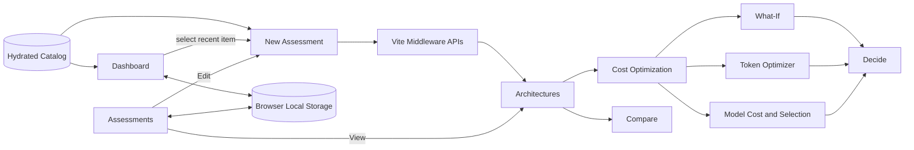

# AI Architecture Decision Engine - Page-by-Page Implementation

## 1. Application Shell And Navigation

**Implementation:** `src/App.tsx`

The application is a React single-page application. It does not use a router. `App` stores the active page in React state and conditionally renders the page component. The Vite server hosts the SPA and the middleware APIs.

### Navigation order

1. Dashboard
2. New Assessment
3. Architectures
4. Cost Optimization
5. Decide
6. Assessments
7. AI Model Search
8. Compare
9. Settings

The sidebar supports desktop collapse and a mobile drawer. The top bar shows breadcrumbs, notifications, help, and the current profile. Page selection closes the mobile drawer automatically.

### Shared application state

- `decision`: latest `DecisionResult` returned by the recommendation engine.
- `activePage`: current navigation page.
- `editingId`: saved assessment being edited in New Assessment.
- `currentRecordId`: assessment associated with the active decision.
- `selectedOption`: selected architecture candidate.
- `selectedModelId`: explicit model selection from Model Cost & Selection.
- `optimizedTokenUsage`: applied token optimization override.
- `whatIfScenario`: latest applied What-If scenario.
- `costOptimizationView`: `scenario`, `tokens`, or `models`.
- `history`: assessment records persisted in browser `localStorage` under `ai-architect.assessments.v1`.
- `catalogState`: loading, ready, or error while the catalog is hydrated.

### Shared decision lifecycle

1. `loadArchitectureCatalog()` loads and validates the versioned catalog.
2. A recommendation request returns a deterministic `DecisionResult`.
3. The result is stored in application state and written to browser history.
4. What-If, model selection, and token optimization derive updated decision views without mutating the original baseline.
5. The Decide page applies the final scenario, selected model, and optimized token usage before generating the ADR.

## 2. Dashboard

**Implementation:** `Dashboard` in `src/App.tsx`; styling in `src/App.css`; image asset in `public/architecture-solution.png`.

### Purpose

The Dashboard is the entry point for monitoring saved assessments and explaining the complete solution at a glance.

### Visible sections

- Dashboard heading and New Assessment action.
- Hackathon idea statement above the solution architecture image.
- Exact supplied solution architecture image rendered as a plain image.
- New Architecture Assessment card.
- Recent Assessments card.
- Cost Optimization card.
- AI Token Consumption card.

The previous Recommended Solutions and Security & Responsible AI cards were removed.

### Recent assessment behavior

Selecting a recent assessment calls `editRecord(record)`, sets `editingId`, and opens New Assessment with the saved `WorkloadInput` prefilled. This is different from the Assessments page, where View opens Architectures and Edit opens New Assessment.

### Calculated dashboard values

- Projected cost is summed only for recommendations with available official pricing.
- Pending prices are shown as unavailable rather than converted to zero.
- Potential savings compare the recommended architecture with the lowest-cost available recommendation.
- Projected token consumption is calculated from monthly requests and input/output tokens.

### Data dependencies

- `history` from browser `localStorage`.
- `runDecisionEngine()` for each saved assessment.
- `public/architecture-solution.png` for the architecture image.

## 3. New Architecture Assessment

**Implementation:** `NewAssessment` in `src/App.tsx`.

### Purpose

Captures the business problem and architecture-significant constraints before any product or architecture is selected.

### Form sections

**Business outcome**

- Assessment name.
- Business problem description.
- Expected scale.
- AI requirement.

**AI Understanding**

- Calls `POST /api/analyze` after the business description is stable.
- Debounces the request by 700 ms.
- Aborts stale requests when the description changes.
- Applies a 30-second request timeout.
- Displays detected capabilities, workloads, assumptions, and analysis status.
- Lets the user remove assumptions or add an editable assumption.

**What matters most**

- Response-time target.
- Data sensitivity.
- Monthly request range.
- Peak requests per minute.

**Advanced Requirements**

- Compliance checkboxes: GDPR, HIPAA, SOC 2, ISO 27001, FedRAMP, PCI DSS.
- Security checkboxes: PII Protection, Data Loss Prevention, Private Networking, Customer-Managed Keys, Multi-Factor Authentication.
- Cloud preference.
- Existing technology.
- Integrations.

**AI Assessment action**

- Shows completeness state.
- Requires valid live analysis before generation.
- Calls `onGenerate(input)` when Generate Architecture is clicked.
- Shows the Requirements to Recommendation progress flow while evaluation runs.

### API dependencies

- `POST /api/analyze` for advisory requirement extraction.
- Parent callback invokes `requestRecommendation()` through `generateDecision()`.

### Important design behavior

Azure AI is constrained to extract requirements and signals. Explicit form inputs remain authoritative. The model does not select a winning architecture.

## 4. Architectures

**Implementation:** `ArchitectureDecision` in `src/ArchitectureDecision.tsx`.

### Purpose

Presents the deterministic architecture recommendation, alternatives, evidence, cost, performance, security, and decision reasoning.

### Main sections

- Requirement Fit and gate status.
- Architecture options list.
- Selected solution architecture diagram.
- Component rationale and functional/non-functional mappings.
- Recommendation summary and confidence.
- Cost range and category breakdown.
- Performance, scalability, availability, and reliability metrics.
- Risks and mitigations.
- Trade-offs between the selected option and alternatives.
- Decision Trace.
- Evidence records and assumptions.
- Comparison table.

### User actions

- Select an architecture candidate.
- Change the platform provider.
- Edit the current assessment.
- Move to Cost Optimization through the What-If action.
- Inspect architecture components and evidence.
- Use Compare as a separate navigation page.

### Decision data

The page receives a `DecisionResult` and selected candidate ID. It does not calculate an independent recommendation. It renders the output of:

- `src/domain/decisionEngine.ts`
- `src/resource/resourceEstimator.ts`
- `src/cost/costEngine.ts`
- `src/performance/latencyModel.ts`
- `src/security/securityEngine.ts`
- `src/scalability/scalabilityEngine.ts`
- `src/availability/availabilityEngine.ts`
- `src/confidence/confidenceEngine.ts`

### Eligibility semantics

- `eligible`: requirements are satisfied or supported by favorable estimates.
- `partiallyEligible`: unresolved evidence remains.
- `notEligible`: one or more hard gates failed.

The page keeps failed and unresolved reasons visible instead of hiding rejected candidates.

## 5. Cost Optimization

**Implementation:** `src/CostOptimization.tsx`.

Cost Optimization is a shared workspace with three tabs. The selected tab is stored in `App` as `costOptimizationView`.

### 5.1 What-If Scenario

**Implementation:** `src/WhatIfSimulator.tsx`.

Purpose: test how changed requirements alter architecture, eligibility, resources, cost, and evidence.

Controls include:

- Latency target.
- Monthly traffic.
- AI requirement.
- Sensitivity.
- Availability target.
- Cloud provider.
- Compliance.

The simulator retains baseline values, builds a scenario, and calls `evaluateWhatIfScenario()`. It then compares the baseline and scenario results, including:

- Architecture change.
- Provider change.
- Status change.
- Monthly cost change.
- Latency change.
- Passed, unknown, and failed gates.
- Candidate invalidation reasons.

Applying a scenario calls `onScenarioApply()` and carries it to the final decision. Budget controls and separate alternatives/sensitivity sections are intentionally not part of the current workflow.

### 5.2 Token Optimizer

**Implementation:** `src/TokenOptimization.tsx` and `src/cost/tokenOptimizationEngine.ts`.

Purpose: reduce model token cost while preserving use-case behavior and NFRs.

The optimizer receives:

- Current token usage.
- Selected model and model catalog.
- Architecture overhead.
- Knowledge retrieval, generative response, and tool execution signals.
- Assessment-specific use-case context.
- Quality, latency, security, reliability, functional, and compliance requirements.

Each opportunity is selectable and shows:

- Assessment-specific use-case fit.
- NFR guardrail.
- When to choose it.
- Quality impact.
- Complexity impact.
- Risk.

Available levers are conditionally aligned to the workload:

- Reduce RAG context.
- Trim conversation history.
- Limit output size.
- Enable prompt caching.
- Cache common responses.
- Reduce agent calls.
- Reduce tool calls.
- Remove duplicate context.
- Select a lower-cost valid model.

The engine preserves an immutable baseline, applies selected opportunities sequentially, recalculates tokens/cost/latency/quality, and rejects scenarios that violate hard requirements. Valid scenarios rank by validity, score, confidence, and cost.

Applying a valid scenario calls `onApply()` and stores the resulting token usage and model selection in the parent application state.

### 5.3 Model Cost & Selection

**Implementation:** `src/ModelSearch.tsx` rendered with `costFocused`.

Purpose: compare model deployments using the current assessment token profile and choose a valid model.

Features:

- Model search by name, publisher, host, or cloud.
- Host filter.
- Capability filter for vision, audio, video, and tool calling.
- Sort by monthly cost, reasoning, context, or name.
- Editable requests, input tokens, output tokens, and cached-input percentage.
- Published input, cached-input, and output pricing.
- Assessment-specific model recommendation.
- Capability gate explanation.
- Fixed catalog scoring across quality, latency, cost efficiency, reasoning, security, and reliability.
- Valid alternatives table.
- Explicit `Use model` action.

The UI no longer contains adjustable model-priority controls. The fixed catalog weights remain deterministic. The selected model is passed to Decide and recalculates model evidence, AI cost, technology labels, and final totals.

## 6. Decide

**Implementation:** `src/FinalDecision.tsx`.

### Purpose

Provides the final review and approval surface for the selected architecture, model, scenario, and optimization result.

### Final decision composition

1. Starts from the latest decision and applied What-If scenario.
2. Applies optimized token usage when present.
3. Applies explicit model selection through `applySelectedModel()`.
4. Re-evaluates the selected candidate for the final display.

### Visible sections

- Final solution banner.
- Approval or conditional decision status.
- Selected architecture, provider, confidence, and final monthly cost.
- Performance with measured or composed latency.
- Scalability with measured or estimated capacity.
- Reliability readiness index.
- Availability target.
- Security control status.
- Observability and operations posture.
- Detailed solution architecture by functional layer.
- Selected LLM model details.
- Operational quality detail.
- Security and compliance controls.
- Observability and operations.
- Final cost range and category breakdown.

### ADR export

The Download ADR PDF action dynamically imports `src/adrPdf.ts` and generates an Architecture Decision Record from the final candidate. The record reflects the final scenario, selected model, applied token usage, cost, evidence, and rationale.

## 7. Assessments

**Implementation:** `AssessmentHistory` in `src/App.tsx`.

### Purpose

Shows the saved assessment records stored in this browser.

### Record fields

- ID.
- Original `WorkloadInput`.
- Platform override.
- Recommended architecture name.
- Eligibility status.
- Last updated timestamp.

### Actions

- **View:** opens the saved result in Architectures.
- **Edit:** opens New Assessment with the saved input.
- **Reassess:** recalculates the decision against the current in-memory catalog and updates the saved record.

There is no server-side history or shared team repository in the current implementation.

## 8. AI Model Search

**Implementation:** `ModelSearch` in `src/ModelSearch.tsx` without `costFocused`.

### Purpose

Provides the full versioned model catalog for discovery and planning, independent of the focused Cost Optimization tab.

### Features

- Search models by name, provider, and hosting platform.
- Filter by hosting provider.
- Filter by vision, audio, video, or tool calling.
- Sort by monthly cost, reasoning, context window, or name.
- Adjust planning assumptions for request volume and token mix.
- Show model capabilities, context window, token rates, monthly estimate, and pricing source.
- Display pricing freshness metadata.

When opened with an active decision, it uses that assessment's token usage as the initial planning baseline. Without a decision, it provides general editable planning assumptions.

## 9. Compare

**Implementation:** `ArchitectureDecision` with `compareMode={true}` from `src/App.tsx`.

### Purpose

Compares the same workload across two platform providers while preserving the logical architecture.

### Behavior

- Uses two provider selectors.
- Runs the decision engine for each provider.
- Shows architecture, status, cost, latency, capacity, availability, and selected model differences.
- Shows only provider-specific service changes and material trade-offs.
- Does not reuse one provider's prices for another provider.
- Shows missing provider price evidence explicitly.

The left navigation places Compare near the end of the menu, immediately before Settings.

## 10. Settings

**Current implementation status:** navigation label exists in `src/App.tsx`, but there is no dedicated Settings page component or settings branch in the current conditional page renderer.

The visible navigation handler currently recognizes the main implemented pages and does not provide a settings content view. This should be treated as an implementation gap rather than a completed page.

### Recommended future implementation

- Profile and tenant settings.
- Authentication and role information.
- Provider endpoint configuration.
- Evidence freshness policy.
- Default model and platform preferences.
- Data retention and local-history controls.
- Feature flags for optional Azure AI Search.
- Accessibility and display preferences.

## 11. API And Server Integration Used By Pages

**Implementation:** `vite.config.ts`, `server/api/recommendationService.ts`, and `server/api/explanationService.ts`.

| Endpoint | Used by | Function |
| --- | --- | --- |
| `GET /api/catalog/architectures` | App startup, model and architecture views | Loads the versioned catalog |
| `POST /api/analyze` | New Assessment | Azure AI requirement extraction and normalization |
| `POST /api/recommendations` | Generate Architecture | Validates input and runs recommendation service |
| `POST /api/recommendations/explain` | Architecture view | Generates bounded prose from deterministic facts |
| `GET /api/evidence/search` | Evidence overlays | Retrieves optional scoped Azure AI Search evidence |

The browser never receives Azure credentials. Local development obtains an Entra token server-side through Azure CLI. Production should replace this with managed identity.

## 12. Page-Level Data And State Flow



## 13. Testing And Verification

Relevant automated coverage includes:

- Recommendation service request validation.
- Explanation prompt and response shape.
- Catalog loading, derivation, and evidence validation.
- Model capability gating and model pricing.
- Architecture cost and resource estimation.
- Latency composition.
- Security, availability, confidence, and scalability evaluation.
- What-If scenario behavior.
- Token optimization baseline immutability, sequential scenarios, invalidation, and ranking.
- ADR PDF generation.

Run the current checks from the repository root:

```powershell
npm run lint
npm test
npm run build
```

## 14. Current Gaps

- Settings has navigation but no implemented page content.
- Assessment history is browser-local and not multi-user.
- No authentication or authorization is implemented in the application shell.
- No durable approval or audit store is implemented.
- No production deployment IaC or scheduled evidence infrastructure exists.
- Browser-level page tests are limited compared with unit and service tests.
- The live walkthrough script can become brittle when UI labels or selectors change; its selectors should be kept synchronized with current page markup.
